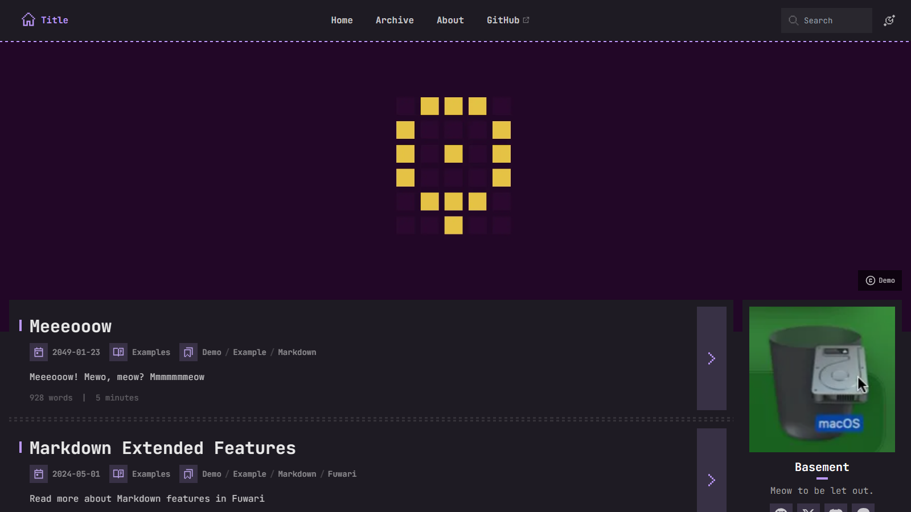

# 💠 Pixshot

## What's this?
A static blog template built with [Astro](https://astro.build).

## How's this?
This template forks from [Fuwari](https://github.com/saicaca/fuwari), inherits all its features and contains more feature updates and more beautiful LAF, and is updated regularly from upstream.

[**🖥️ Live Demo (Vercel)**](https://fuwari.vercel.app)

> README version: `01 Dec 2025`



## ✨ Upstream Features

- [x] Built with [Astro](https://astro.build) and [Tailwind CSS](https://tailwindcss.com)
- [x] Smooth animations and page transitions
- [x] Light / dark mode
- [x] Customizable theme colors & banner
- [x] Responsive design
- [ ] Comments
- [x] Search
- [ ] TOC

> Maybe we'll add the featue of author todo? Yep, Maybe.

## 🚀 How to Use

1. [Generate a new repository](https://github.com/boo-base/pixshot/generate) from this template or fork this repository.
2. To edit your blog locally, clone your repository, run `bun install` to install dependencies.
    - Install [Bun](https://bun.sh) `scoop install bun` or `brew install bun` if you haven't.
3. Edit the config file `src/config.ts` to customize your blog.
4. Run `bun new-post <filename>` to create a new post and edit it in `src/content/posts/`.
5. Deploy your blog to Vercel, Netlify, GitHub Pages, etc. following [the guides](https://docs.astro.build/en/guides/deploy/). You need to edit the site configuration in `astro.config.ts` before deployment.

## 📟️ Frontmatter of Posts

```yaml
---
title: My First Blog Post
published: 2025-01-01
description: This is the first post of my new Astro blog.
image: ./cover.jpg
tags: [Foo, Bar]
category: Front-end
draft: false
lang: vn      # Set only if the post's language differs from the site's language in `config.ts`
---
```
